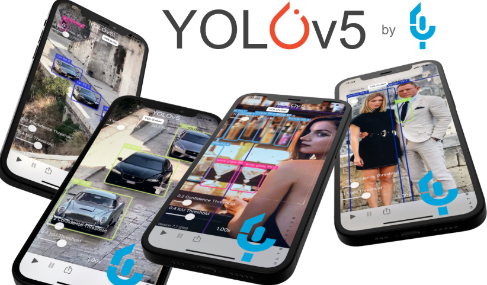
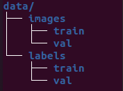
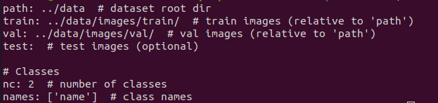

# YoloV5 Custom Object Detection

# Introduction

Fast, precise and easy to train, YOLOv5 has a long and successful history of real time object detection. Treat YOLOv5 as a university where you'll feed your model information for it to learn from and grow into one integrated tool. You can get started with less than 6 lines of code. with YOLOv5 and its  Pytorch implementation.

Start training your model without being an expert. Students love YOLOv5 for its simplicity and there are many quickstart examples for you to get started within seconds.

Export and deploy your YOLOv5 model with just 1 line of code. There are also loads of quickstart guides and tutorials available to get your model where it needs to be.

# Steps for train on custom data

1. Clone !git clone https://github.com/ultralytics/yolov5

2. Organize your train and val images and labels according to the example below. In this example we assume /coco128 is next to the /yolov5 directory. YOLOv5 locates labels automatically for each image by replacing the last instance of /images/ in each image path with /labels/. For example:
   1. data/images/train = All images to be trained 
   2. data/images/val = 10% images to be trained for achieve metrics
   3. data/labels/train = Labels coordinates
   4. data/labels/train = 10% labels coordinates

   

3. Labels coordinate: https://www.makesense.ai/
4. Create custom.yml file for the next information, and save in path = yolov5/data

